# Blackboard ULima Estudiantes

## ¿Qué es?

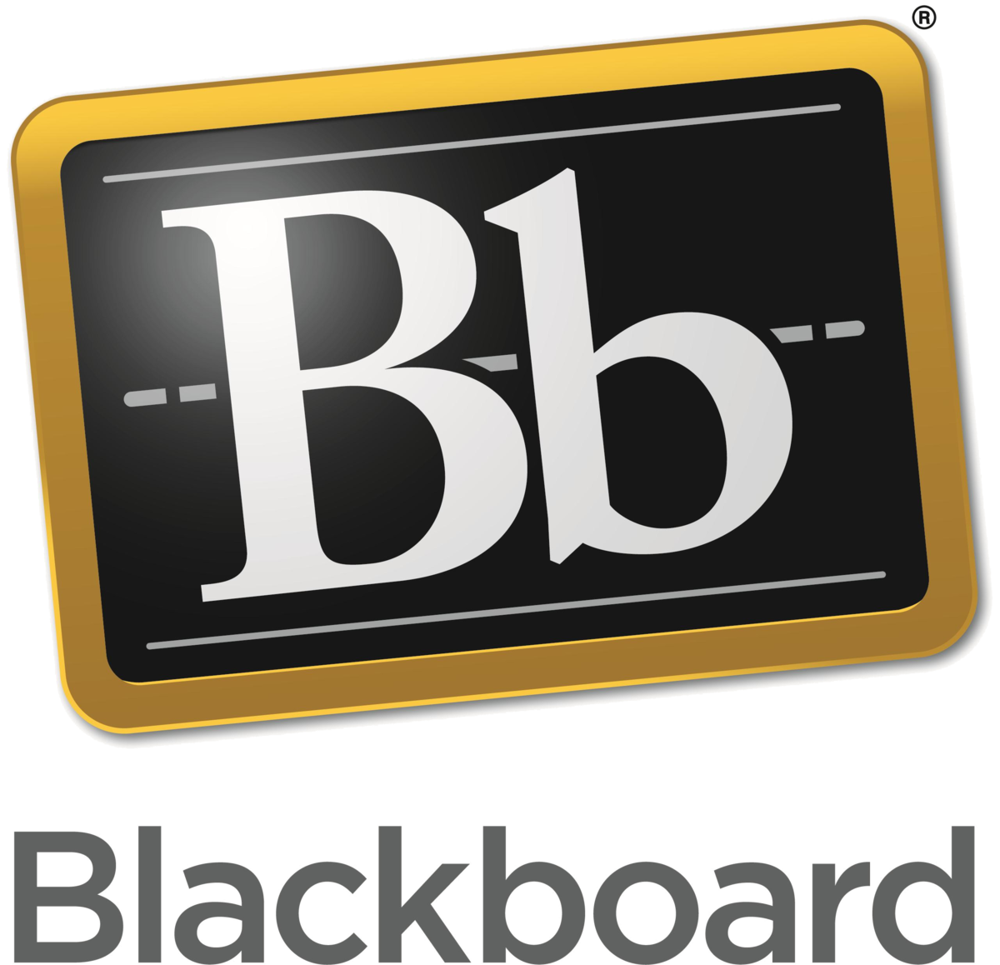

Una plataforma interactiva que incentiva a tener una mejor experiencia de aprendizaje y enseñanza.

## Elementos que contiene el Blackboard ULima:

* Módulo de contenidos
* Herramientas de comunicación
* Herramientas de evaluación
* Herramientas de seguimiento y gestión de aprendizaje.

  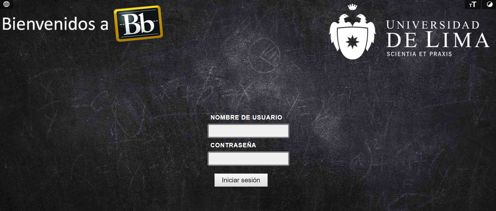
  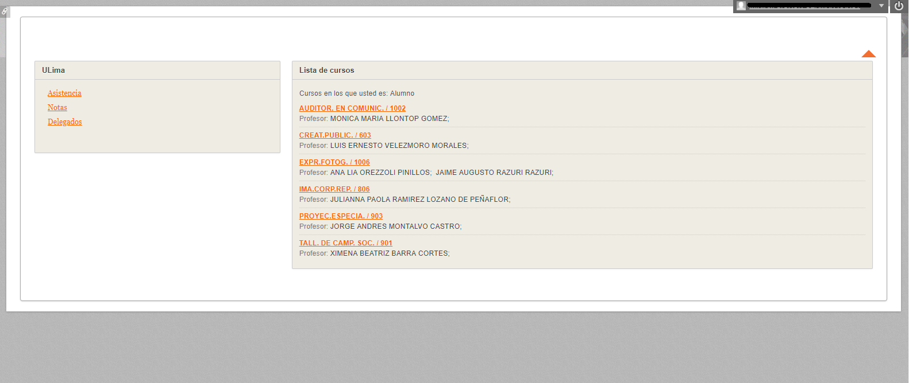
  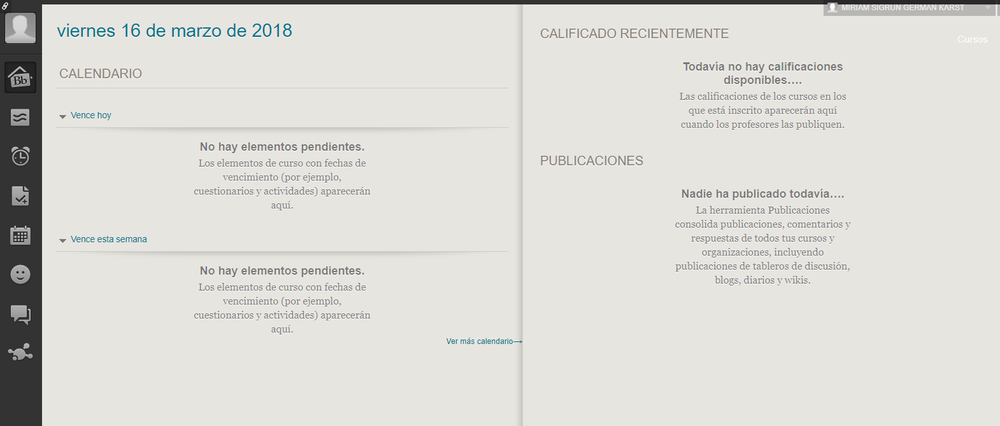
  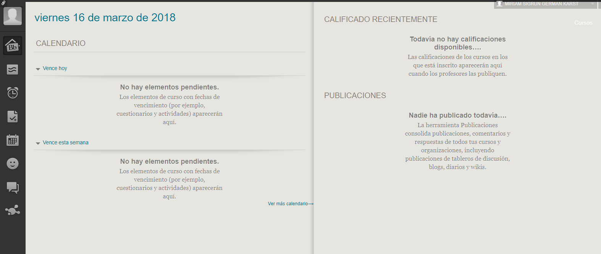
  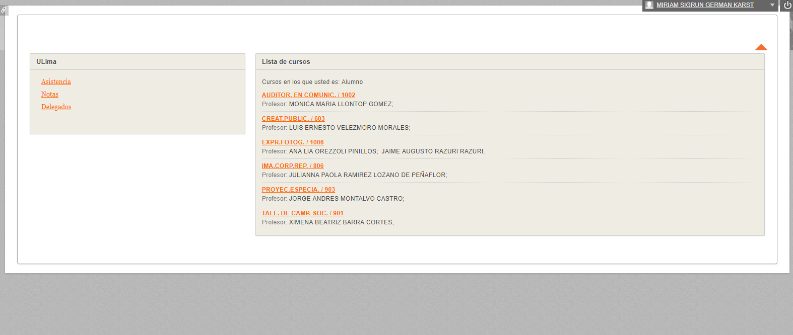
  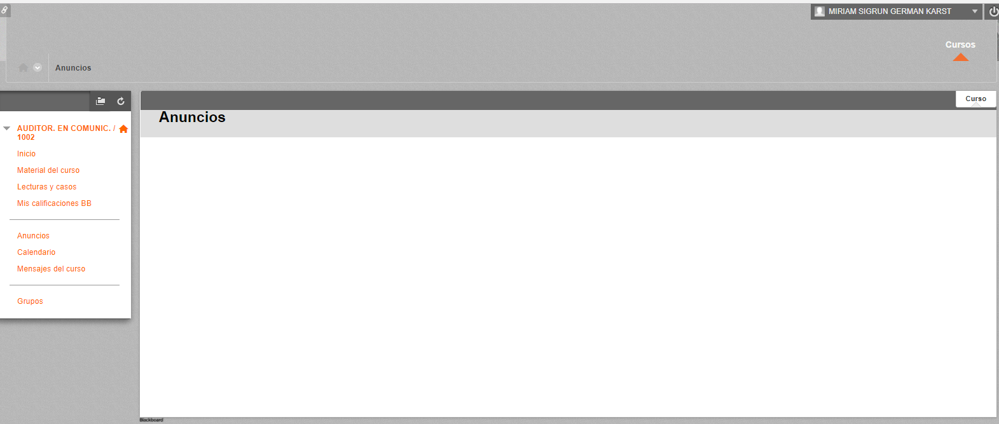
  

## Ventajas del Blackboard  debe ofrecer:

* Flexibilidad: integración con otras LMS y aplicaciones.
* Repositorios para almacenar objetos de aprendizaje.
* Promueve la colaboración.

## Detalles de la Propuesta:

Rediseño del Blackboard ULima, el reto propuesto consiste en hacer de esta Plataforma Digital una sitio Web entendible y amigable para el usuario (estudiante de la Universidad de Lima).

## A. Recolección de Información (Fuente: Estudiantes Universidad de Lima)

### Entrevistas Personales:

  * Se solicitó a 4 estudiantes de la Universidad de Lima (Miriam Germán Karts / Manira Chaker Cruz / Manuel Bianchi Ferrand / Yesseni Reto Jurado), utilicen  la web del Blackboard de la ULima, nos cuenten su experiencia, cuál fue su sensación, la frecuencia que lo usan y en qué les facilitó a su vida como estudiantes

  "El 100% de los entrevistados, dijo que es algo inútil para ellos."

  "El 100% dijo que es demasiado confuso"

  "El 100% comentó que habían interacciones que no servían y/o no sabían para qué estaban"

  "El 100% lo cree aburrido y nada amigable para el usuario"

  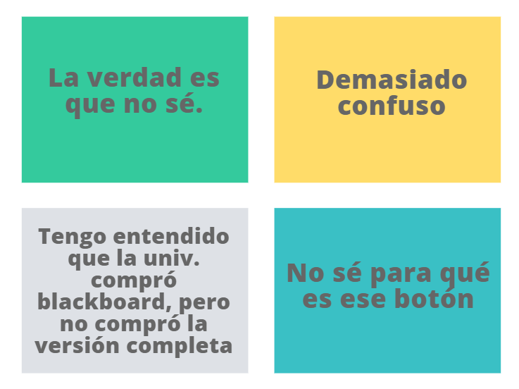

* Objetivo del Rediseño:

  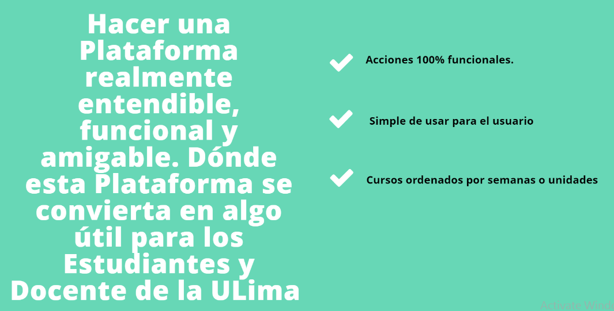

* Beneficios que ofrecerá el Rediseño:

## B. Síntesis y Definición

* ¿Qué debe proveer, el Blackboard ULima?

  Enseñanza y aprendizaje.

  Copnstrucción de comunidades.

  Manejo y colaboración de contenido.

  Experiencias colaborativas.

  Compromiso de mejora constante.

  Poder ver con facilidad el contenido de sus cursos matriculados.

## C. User Persona:  

  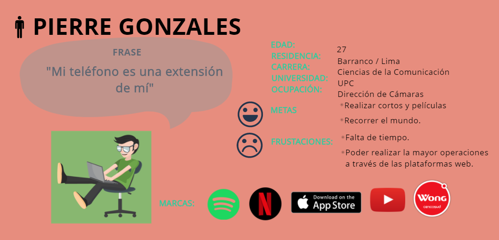

## D. BMC:

  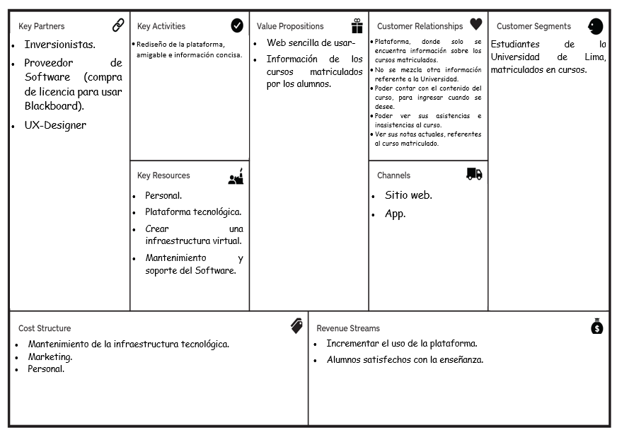

## E. PROTOTIPADO:

### Actividades:

* Se utilizó Figma para el desarrollo de las vistas y Marvel para darle interacción a las vistas del prototipo-

* Prototipo Deskopt: [Ver Prototipo](https://marvelapp.com/3231g2i/screen/40035363)

## D. TESTING:

**Testing e Iteración**

  * Se realizó iteraciones con 4 estudiantes de la Univeridad de Lima (Athina Del Águila / Gonzalo Troncoso / Melissa Negrón / Lucina Fonseca)

  * El usuario se perdía en la sección de cursos (la barra no le indicaba exactamente dónde se encontraba).
  * Siente innecesario la sección de PERFIL en la barra principal, ya que es una información que no la necesitan (ellos ya saben su información), debería estar en un lugar que no sea en la sección principal.
  * Les gusta que esté centrado solo en los cursos (sin información adicional, como noticias sobre la universidad y otros) que se encuentran matriculados.
  * Creen necesario contar con la App, ya que quieren acceder a esa información en cualquier momento y lugar.
  * Sienten que al iniciar sesión se encuentra muy vacío.
  * No saben a dónde dirigirse si no recuerdan su contraseña.
  * El usuario que es la primera vez que usa la plataforma, no esta seguro qué usuario usar (no se indica que es su usuario de alumno de la Universidad de Lima).

## E. PROTOTIPO MEJORADO:

* Prototipo Deskopt: [Ver Prototipo](https://marvelapp.com/64f6di1/screen/40180488)

* Prototipo Movile: [Ver Prototipo](https://marvelapp.com/3232894/screen/40036119)
