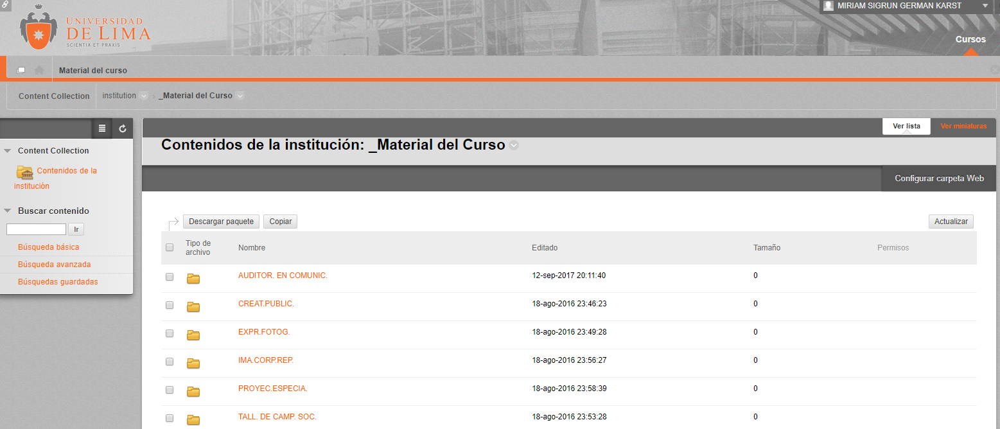

# Blackboard ULima

## ¿Qué es?

Una plataforma interactiva que incentiva a tener una mejor experiencia de aprendizaje y enseñanza.

## Elementos que contiene el Blackboard ULima:

* Módulo de contenidos
* Herramientas de comunicación
* Herramientas de evaluación
* Herramientas de seguimiento y gestión de aprendizaje.

  
  
  
  
  
  
  

## Ventajas del Blackboard ULima:

* Flexibilidad: integración con otras LMS y aplicaciones.
* Repositorios para almacenar objetos de aprendizaje.
* Promueve la colaboración.

## Detalles de la Propuesta:

Rediseño del Blackboard ULima, el reto propuesto consiste en hacer de esta Plataforma Digital una sitio Web entendible y amigable para el usuario (estudiante y docentes de la Universidad de Lima).

## A. Recolección de Información (Fuente: Estudiantes Universidad de Lima)

  "El 100% de los entrevistados, dijo que es algo inútil para ellos."

  "El 100% dijo que es demasiado confuso"

  "El 100% comentó que habían interacciones que no servían y/o no sabían para qué estaban"

  "El 100% lo cree aburrido y nada amigable para el usuario"

  

* Objetivo del Rediseño:

  

* Beneficios que ofrecerá el Rediseño:

## B. Síntesis y Definición

* ¿Qué debe proveer, el Blackboard ULima?

  Enseñanza y aprendizaje.

  Copnstrucción de comunidades.

  Manejo y colaboración de contenido.

  Experiencias colaborativas.
  
  Compromiso de mejora constante.

## C. Ideación
